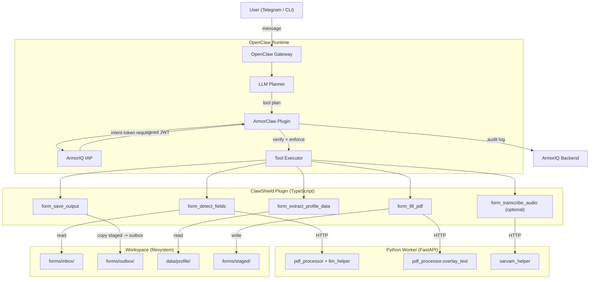

# ClawShield Implementation Plan

## Goal

Transform the existing Python PDF form-filling assistant into an OpenClaw + ArmorClaw hackathon submission with intent-aware policy enforcement, custom tools, and structured logging.

Key requirements:

- autonomous multi-step execution
- clear separation between reasoning and execution
- policy-based runtime enforcement via ArmorClaw + ArmorIQ
- visible allow/block outcomes
- traceable decision logs

## 0. Standardize Inference on OpenRouter ✅

- ~~Move all LLM inference to OpenRouter.~~
- ~~Read `OPENROUTER_MODEL` and `OPENROUTER_API_KEY` from `.env`.~~
- ~~Treat these as the single default inference configuration for:~~
  - ~~form field detection~~
  - ~~voice transcript cleanup~~
  - ~~any planning or extraction prompts that require an LLM~~
- ~~Remove UI-level provider switching from the old Streamlit flow.~~
- ~~Expose model selection through environment configuration, not hardcoded UI controls.~~

**Done.** Added `utils/config.py` as the centralized config loader. All LLM calls in `llm_helper.py` and `sarvam_helper.py` now default to env config. Sidebar LLM controls removed from `app.py`. Added `OPENROUTER_VISION_MODEL` env var for vision-specific tasks.

## 1. Reframe the Product for This Hackathon

- Position the project as `ClawShield`, an intent-aware form automation agent.
- The core story is not "AI fills forms" but "an autonomous agent fills forms only within explicit, enforced user intent boundaries."
- The old project provides the domain workflow; the new project must provide the enforcement architecture.

## 2. Target Stack

- Use OpenClaw as the agent runtime (gateway, LLM planner, tool executor).
- Use ArmorClaw as the OpenClaw plugin for intent verification and policy enforcement, backed by ArmorIQ IAP for signed intent tokens and audit logging.
- Build a **TypeScript OpenClaw plugin** (`plugin/`) that registers all custom tools and handles path validation, worker HTTP calls, and structured logging.
- Wrap the existing Python PDF processing logic as a **FastAPI worker service** (`worker/server.py`) running on `localhost:8100`, exposing endpoints for field detection, profile extraction, PDF filling, and transcription.
- Use `.env` for runtime secrets and model configuration.
- User interface: **Telegram** (quickest demo path) or CLI during development.

## 3. Reuse Strategy from the Existing Codebase

### Reuse via FastAPI worker

Keep all existing `utils/` code intact and wrap it behind the FastAPI worker service (`worker/server.py`):

- `utils/pdf_processor.py` — PDF-to-image conversion and overlay logic → exposed via `/detect-fields` and `/fill-pdf` endpoints
- `utils/llm_helper.py` — form field detection prompt and JSON normalization → called by `/detect-fields`
- `utils/sarvam_helper.py` — optional voice flow → exposed via `/transcribe`
- New `worker/profile_extractor.py` — reads JSON profiles, maps keys to fields using fuzzy/LLM matching → exposed via `/extract-profile`

### Do not reuse as-is

- The Streamlit app shell in `app.py` (preserved but not used in new flow)
- Direct temp-file based execution without scoped policies
- Free-form tool invocation without intent validation

## 4. New Architecture



The system has four layers:

1. `OpenClaw Runtime`
   - Gateway accepts the user request (via Telegram or CLI)
   - LLM Planner produces a structured execution plan
   - ArmorClaw plugin requests a signed intent token from ArmorIQ IAP, then verifies and enforces policy on each tool call

2. `ClawShield Plugin (TypeScript)`
   - Registers all custom tools via `api.registerTool()` with TypeBox schemas
   - Each tool validates paths against workspace boundaries before execution
   - Calls the Python worker over HTTP for heavy processing

3. `Python Worker (FastAPI)`
   - Runs on `localhost:8100`
   - Wraps existing `utils/` code behind HTTP endpoints (`/detect-fields`, `/extract-profile`, `/fill-pdf`, `/transcribe`)
   - Isolated from the agent runtime; only reachable via the plugin's HTTP client

4. `Workspace (filesystem)`
   - `forms/inbox/` — input PDFs
   - `forms/outbox/` — final filled PDFs
   - `forms/staged/` — intermediate artifacts before save
   - `data/profile/` — user profile data sources
   - `logs/` — structured trace logs

## 5. Intent Model

Define a structured intent object instead of relying on prompt text alone.

Schema (stored at `workspace/intent.schema.json`):

```json
{
  "goal": "fill_form",
  "input_document": "workspace/forms/inbox/scholarship.pdf",
  "data_sources": [
    "workspace/data/profile/student_profile.json"
  ],
  "requested_actions": [
    "analyze_form",
    "extract_profile_data",
    "fill_pdf",
    "save_output"
  ],
  "output_destination": "workspace/forms/outbox/",
  "forbidden_actions": [
    "email",
    "upload",
    "read_sensitive_dirs",
    "write_outside_outbox"
  ]
}
```

The agent system prompt (`SOUL.md`) enforces intent-first planning:

1. Parse the user request into this intent structure
2. Emit the intent as a structured message before planning any tool calls
3. Reference the intent when selecting tools and validating actions

## 6. Policy Model

Policies are configured via ArmorClaw chat commands or programmatically through a setup script (`scripts/init-policies.sh`).

Initial policy set:

- **allow `form_detect_fields` / `form_fill_pdf`** — scoped to `workspace/forms/inbox/` paths
- **allow `form_extract_profile_data`** — scoped to `workspace/data/profile/` paths
- **allow `form_save_output`** — constrain `destination_path` to `workspace/forms/outbox/` only
- **deny `write_file` globally** — prevent the agent from using OpenClaw's built-in `write_file` to bypass custom tools
- **deny `exec` / shell** — prevent arbitrary command execution
- **deny `web_fetch`** (or scope narrowly) — the agent should not make arbitrary web requests
- **deny `read_file` outside workspace** — prevent access to sensitive system paths
- deny overwriting existing files unless explicitly requested in intent
- deny email, upload, share, or publish actions

## 7. Tool Design

Implement a narrow tool surface so each action can be verified independently. Each tool uses `api.registerTool()` with TypeBox schemas in the plugin.

Tools:

- `form_detect_fields(pdf_path)`
  - validates `pdf_path` is under `workspace/forms/inbox/`
  - calls Python worker `/detect-fields`
  - returns normalized field schema as JSON

- `form_extract_profile_data(profile_paths, field_schema)`
  - validates each profile path is under `workspace/data/profile/`
  - calls Python worker `/extract-profile`
  - returns `{values, confidence, missing_fields}`

- `form_fill_pdf(pdf_path, field_values)`
  - validates `pdf_path` is under `workspace/forms/inbox/`
  - calls Python worker `/fill-pdf`
  - writes output to `workspace/forms/staged/`
  - returns staged file path

- `form_save_output(staged_file, destination_path)`
  - validates `staged_file` is under `workspace/forms/staged/`
  - validates `destination_path` is under `workspace/forms/outbox/`
  - denies overwrite of existing files unless intent explicitly allows
  - copies staged file to destination

- `form_transcribe_audio(audio_path, language)` (optional)
  - validates `audio_path` is within workspace
  - calls Python worker `/transcribe`
  - returns cleaned text

## 8. Separation of Reasoning and Execution

Keep the architecture visibly split:

- reasoning decides what should happen
- enforcement checks whether it may happen
- execution performs the action only after approval

Do not let the LLM call file operations directly. All side effects must pass through policy-checked tools.

## 9. Logging and Traceability

Log structured JSON entries to `workspace/logs/trace-{timestamp}.jsonl`.

Entry format:

```json
{
  "timestamp": "2026-03-15T10:30:00Z",
  "event": "tool_call",
  "tool": "form_detect_fields",
  "args": {"pdf_path": "workspace/forms/inbox/scholarship.pdf"},
  "intent_ref": "fill_form",
  "policy_decision": "allowed",
  "result_summary": "detected 8 fields",
  "duration_ms": 3200
}
```

Event types:

- `intent_parsed` — raw user request + normalized intent object
- `plan_proposed` — the LLM's proposed tool sequence
- `policy_check` — per-tool allow/block with reason
- `tool_executed` — tool name, args, result summary, duration
- `tool_blocked` — tool name, args, block reason
- `output_saved` — final artifact path

ArmorClaw also produces its own audit trail on the ArmorIQ backend. The local logs complement this for the demo.

## 10. Demo Design

The demo should show one clear success path and at least one clear blocked path.

### Allowed path

1. Place `scholarship.pdf` in `workspace/forms/inbox/`
2. Place `student_profile.json` in `workspace/data/profile/`
3. User message: "Fill the scholarship form using my student profile"
4. Agent produces intent object, plans 4 tool calls
5. ArmorClaw issues intent token, verifies each step
6. All 4 tools execute successfully
7. Filled PDF appears in `workspace/forms/outbox/scholarship_filled.pdf`
8. Logs show: intent parsed → plan → 4 allowed steps → output saved

### Blocked path

Three scenarios to implement (at least one required):

**Scenario A: Write outside outbox**

- User: "Fill the form and save it to /tmp/output.pdf"
- `form_save_output` tool-level validation rejects the path
- Policy also denies write outside workspace
- Log shows: `tool_blocked, reason: destination outside approved outbox`

**Scenario B: Read sensitive files**

- User: "Use my /etc/passwd to find missing fields"
- `form_extract_profile_data` rejects path outside `workspace/data/profile/`
- Policy denies `read_file` outside workspace
- Log shows: `tool_blocked, reason: path outside allowed data sources`

**Scenario C: Email/upload the result**

- User: "Email the filled form to admin@example.com"
- No email tool is registered; ArmorClaw blocks any attempt to use `web_fetch` or `exec` for this
- Log shows: `tool_blocked, reason: action not in allowed intent`

## 11. Delegation Bonus

If time permits, split the flow into bounded sub-agents with limited tool access via OpenClaw agent config tool allowlists:

- `Field Extraction Agent`
  - can only call `form_detect_fields`; read-only inbox access

- `Fill Agent`
  - can only call `form_extract_profile_data` + `form_fill_pdf`; read profile, write staged

- `Delivery Agent`
  - can only call `form_save_output`; read staged, write outbox

Any attempt by a delegated agent to exceed scope (e.g., Fill Agent trying to save to outbox directly) is blocked by ArmorClaw.

## 12. Build Order

1. Install OpenClaw + ArmorClaw, configure with OpenRouter and ArmorIQ API keys, verify gateway starts.
2. Create workspace directory tree (inbox, outbox, staged, profile, logs) with sample test data.
3. Build FastAPI worker service wrapping existing Python utils (detect-fields, extract-profile, fill-pdf, transcribe endpoints).
4. Scaffold the TypeScript plugin: manifest, `package.json`, `tsconfig.json`, entry point.
5. Implement all 4 core tools with path validation and worker HTTP calls.
6. Define intent schema, write `SOUL.md` system prompt enforcing intent-first planning.
7. Configure ArmorClaw policies and create `scripts/init-policies.sh`.
8. Implement structured JSON logger in the plugin.
9. Test and verify the full happy path.
10. Implement and test at least one blocked scenario.
11. Add delegation only if the base flow is already stable.
12. Write `docs/DESIGN.md`, architecture diagram, and `README.md`.

## 13. Deliverables to Prepare

- source repository
- `docs/architecture.png` — exported from the mermaid diagram above
- `docs/DESIGN.md` covering:
  - intent model: schema, how it's generated, how it's referenced
  - policy model: list of policies, enforcement points, evaluation order
  - enforcement mechanism: ArmorClaw flow, tool-level validation, logging
- `README.md` — setup instructions, prerequisites, how to run
- `SOUL.md` — agent personality + intent enforcement instructions
- `scripts/init-policies.sh` — reproducible policy initialization
- three-minute demo video with:
  - system overview
  - one allowed action
  - one blocked action
  - explanation of why the block occurred

## 14. Success Criteria

The project is ready for submission when all of the following are true:

- OpenClaw is the runtime entry point (gateway + LLM planner)
- ArmorClaw validates or blocks each meaningful tool action via signed intent tokens from ArmorIQ IAP
- the ClawShield TypeScript plugin registers all custom tools and the Python FastAPI worker handles processing
- the form-filling workflow executes end to end through the plugin tools
- the output is saved only within approved scope (`workspace/forms/outbox/`)
- at least one realistic violation is blocked deterministically
- structured JSONL logs clearly explain both outcomes
- inference configuration comes from `.env` via `OPENROUTER_MODEL` and `OPENROUTER_API_KEY`
- `SOUL.md` enforces intent-first planning
- `scripts/init-policies.sh` reproduces the policy state
